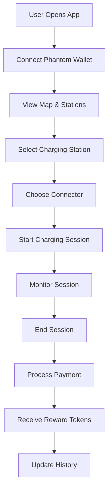
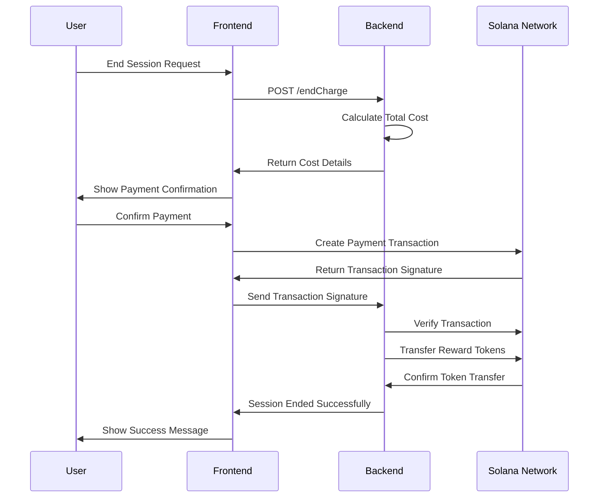
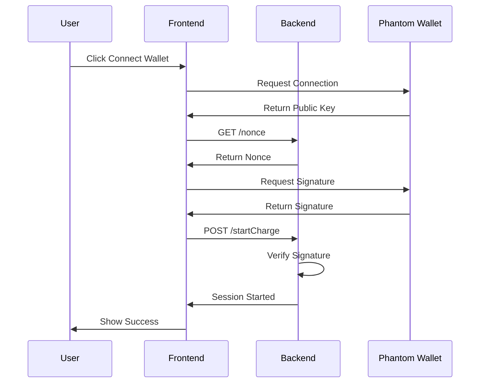
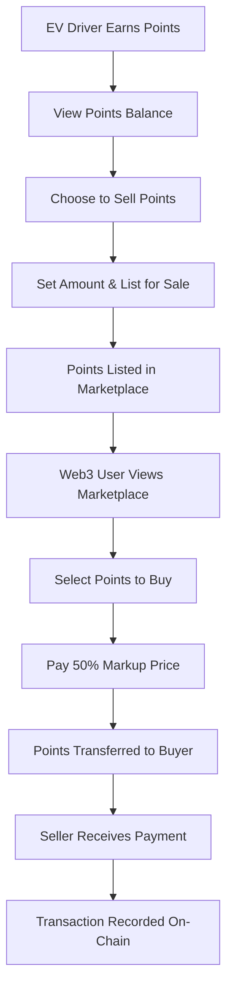
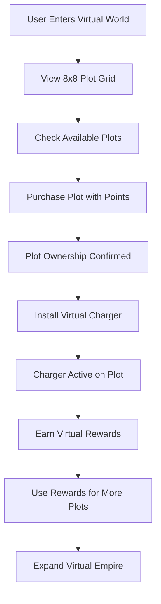
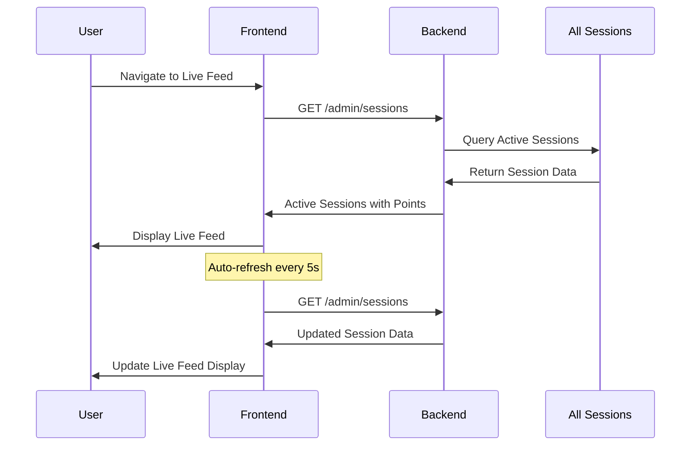
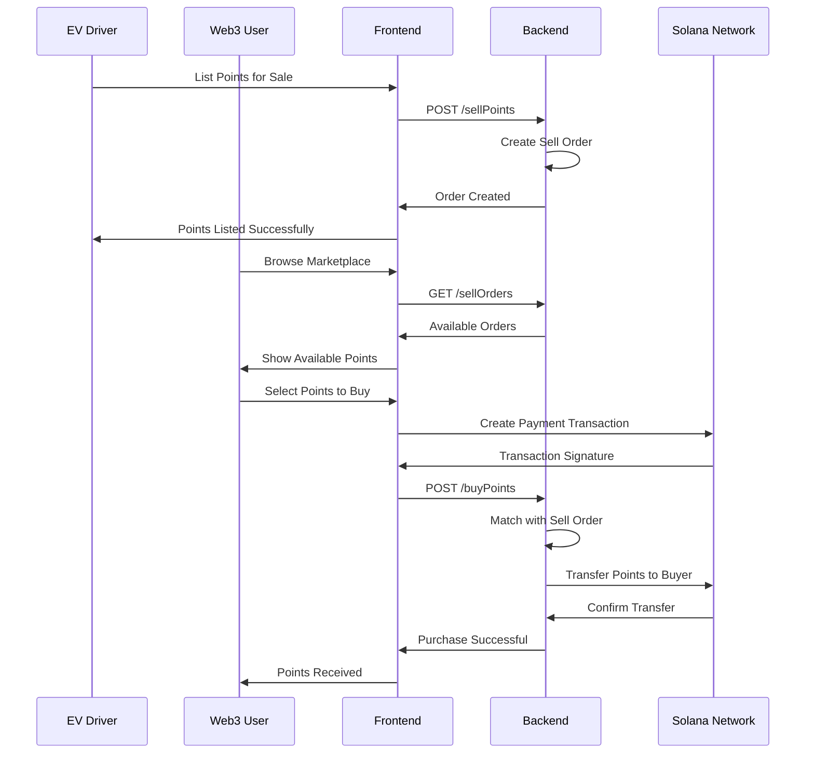

# ⚡ EV Charging DApp - Decentralized Electric Vehicle Charging Network

A comprehensive decentralized application (DApp) for electric vehicle charging built on the Solana blockchain. This project enables users to find, connect to, and pay for EV charging sessions using cryptocurrency, with a modern web interface and robust backend infrastructure.

## 🏆 Hackathon Submission

This project is developed for the **"Anons with Amperes"** hackathon hosted by [DeCharge Network](https://earn.superteam.fun/listing/anons-with-amperes) on Superteam Earn.

### Hackathon Details
- **Track**: Cypherpunk Track - Special Colosseum Hackathon
- **Prize Pool**: 3,500 USDC Total
  - 🥇 1st Place: 1,000 USDC
  - 🥈 2nd Place: 1,000 USDC  
  - 🥉 3rd Place: 1,000 USDC
  - 4th-5th Place: 250 USDC each
- **Skills Required**: Frontend, Backend, Blockchain
- **Status**: Open for submissions
- **Winner Announcement**: November 14, 2025

### Submission Focus
This DApp addresses the hackathon's goal of creating innovative solutions for electric vehicle charging infrastructure using blockchain technology, focusing on:
- Decentralized charging network management
- Cryptocurrency-based payment systems
- Real-time session monitoring
- Reward token mechanisms for sustainable charging

## 📋 Table of Contents

- [Overview](#-overview)
- [Features](#-features)
- [Architecture](#-architecture)
- [Admin Panel](#️-admin-panel)
- [Technology Stack](#️-technology-stack)
- [Installation & Setup](#-installation--setup)
- [Project Structure](#-project-structure)
- [API Documentation](#-api-documentation)
- [User Flow Diagrams](#-user-flow-diagrams)
- [Database Schema](#-database-schema)
- [Security Features](#-security-features)
- [Deployment](#-deployment)
- [Contributing](#-contributing)
- [License](#-license)

## 🚀 Overview

The EV Charging DApp is a comprehensive blockchain-based solution that revolutionizes electric vehicle charging by providing:

- **Decentralized Infrastructure**: No single point of failure
- **Cryptocurrency Payments**: Secure, instant transactions using Solana
- **Real-time Monitoring**: Live charging session tracking with live feed
- **Reward System**: Token incentives for sustainable charging
- **Points Trading Marketplace**: Web3 users can buy EV driver points at 50% discount
- **Virtual DeCharge Worlds**: Gamified EV ecosystem with limited plots and chargers
- **Modern UI/UX**: Smooth animations and responsive design with glassmorphism aesthetics
- **Mobile Optimized**: Touch-friendly interface with performance optimizations

## ✨ Features

### Core Functionality
- 🗺️ **Interactive Map**: Real-time charging station locations with Leaflet.js
- ⚡ **Session Management**: Start, monitor, and end charging sessions
- 💰 **Crypto Payments**: Solana-based payment processing with transaction verification
- 🎁 **Reward Tokens**: Earn SPL tokens for sustainable charging
- 📊 **History Tracking**: Complete charging session history
- 🔐 **Wallet Integration**: Phantom wallet connectivity with signature verification

### 🆕 New Features (Hackathon Requirements)
- 📡 **Live Charging Feed**: Real-time display of all active charging sessions with points earned
- 🔄 **Points Trading Marketplace**: EV drivers can sell points, Web3 users can buy at 50% discount
- 🎮 **Virtual DeCharge Worlds**: Gamified EV ecosystem with 64 limited plots, virtual chargers, and rewards
- 💎 **On-chain Transparency**: All transactions recorded on Solana blockchain
- 🏆 **Gamification**: Virtual world with plot ownership and charger installation

### User Interface
- 📱 **Responsive Design**: Mobile-first approach with touch optimizations
- 🌓 **Dark/Light Theme**: User preference support with persistent storage
- 🎨 **Modern UI**: Glassmorphism design language with smooth animations
- 🧭 **Intuitive Navigation**: Easy-to-use interface with sidebar navigation
- ⚡ **Real-time Updates**: Live session monitoring with auto-refresh
- 🎭 **Smooth Animations**: Professional transitions and hover effects
- 📱 **Mobile Optimized**: Touch-friendly interactions with performance fixes

## 🏗️ Architecture

```
┌─────────────────────────────────────────────────────────────┐
│                    Frontend (Web Interface)                │
├─────────────────────────────────────────────────────────────┤
│  • React-like Components    • Leaflet Maps                 │
│  • Phantom Wallet Integration • Responsive Design          │
│  • Real-time Updates        • Theme Support               │
│  • Live Charging Feed       • Points Trading UI           │
│  • Virtual World Interface  • Smooth Animations           │
└─────────────────────────────────────────────────────────────┘
                                │
                                ▼
┌─────────────────────────────────────────────────────────────┐
│                    Backend (Node.js/Express)                │
├─────────────────────────────────────────────────────────────┤
│  • REST API Endpoints      • Session Management           │
│  • Solana Integration      • Token Operations              │
│  • Database Operations     • Security & Validation        │
│  • Marketplace Logic       • Virtual World System         │
│  • Points Trading          • Admin Panel                  │
└─────────────────────────────────────────────────────────────┘
                                │
                                ▼
┌─────────────────────────────────────────────────────────────┐
│                    Blockchain Layer (Solana)               │
├─────────────────────────────────────────────────────────────┤
│  • Payment Processing      • Token Transfers               │
│  • Wallet Authentication   • Transaction Verification     │
│  • Smart Contract Logic    • Reward Distribution          │
│  • Points Trading          • Virtual World Assets         │
└─────────────────────────────────────────────────────────────┘
```

## 🛡️ Admin Panel

The DApp includes a comprehensive admin panel (`/admin.html`) with modern styling and advanced features:

### Admin Features
- **📊 Dashboard**: Real-time statistics and metrics
- **⚡ Session Management**: Monitor and control active charging sessions
- **📈 Analytics**: Revenue, energy usage, and reward distribution tracking
- **🔄 Marketplace Oversight**: Monitor points trading activity
- **🎮 Virtual World Management**: Track plot ownership and charger installations
- **🌓 Theme Support**: Dark/light mode with persistent preferences
- **📱 Responsive Design**: Works on all devices

### Admin Endpoints
- `GET /admin/sessions` - View all sessions
- `GET /admin/history` - Complete charging history
- `POST /admin/stopSession` - Stop active sessions
- `GET /marketplaceStats` - Trading analytics
- `GET /virtualWorldStats` - Virtual world metrics

## 🛠️ Technology Stack

### Frontend
- **HTML5/CSS3**: Modern web standards
- **JavaScript (ES6+)**: Interactive functionality
- **Leaflet.js**: Interactive mapping
- **Solana Web3.js**: Blockchain integration
- **Phantom Wallet**: User authentication

### Backend
- **Node.js**: Runtime environment
- **Express.js**: Web framework
- **CORS**: Cross-origin resource sharing
- **Body-parser**: Request parsing

### Blockchain
- **Solana**: High-performance blockchain
- **SPL Tokens**: Token standard
- **TweetNaCl**: Cryptographic signatures
- **Base58**: Address encoding

### Database
- **JSON Files**: Lightweight data storage
- **File System**: Persistent storage
- **In-memory Cache**: Session management

## 🚀 Installation & Setup

### Prerequisites
- Node.js (v16 or higher)
- npm or yarn package manager
- Git

### Installation Steps

1. **Clone the Repository**
   ```bash
   git clone <repository-url>
   cd decharge
   ```

2. **Install Dependencies**
   ```bash
   npm install
   ```

3. **Configure Environment**
   ```bash
   # Copy and configure token settings
   cp token-config.json.example token-config.json
   # Edit token-config.json with your Solana configuration
   ```

4. **Start the Server**
   ```bash
   npm start
   # or
   node index.js
   ```

5. **Access the Application**
   - Open your browser to `http://localhost:3000`
   - Connect your Phantom wallet
   - Start exploring charging stations!

## 📁 Project Structure

```
decharge/
├── 📁 public/                 # Frontend files
│   ├── index.html            # Main application interface
│   ├── admin.html            # Admin dashboard
│   └── old.html              # Legacy interface
├── 📁 db/                    # Database files
│   ├── history.json          # Charging session history
│   ├── nonces.json           # Authentication nonces
│   └── sessions.json         # Active sessions
├── 📁 node_modules/          # Dependencies
├── 📄 index.js               # Main server file
├── 📄 token.js               # Token utilities
├── 📄 token-config.json      # Token configuration
├── 📄 server-keypair.json    # Server wallet
├── 📄 package.json           # Project metadata
├── 📄 cloudflared.exe        # Tunnel executable
└── 📄 README.md              # This file
```

## 🔌 API Documentation

### 🆕 New Endpoints (Hackathon Features)

#### `GET /userPoints?pubkey={wallet-address}`
Get user's total reward points and breakdown.

**Response:**
```json
{
  "totalPoints": 150,
  "breakdown": [
    {
      "sessionId": "session-123",
      "points": 25,
      "kwhUsed": 5.2,
      "completedAt": "2024-01-15T10:30:00Z"
    }
  ]
}
```

#### `POST /sellPoints`
List points for sale in the marketplace.

**Request Body:**
```json
{
  "publicKey": "user-wallet-address",
  "amount": 100
}
```

**Response:**
```json
{
  "success": true,
  "message": "100 points listed for sale",
  "orderId": "order-123",
  "totalSellerValue": 1.0,
  "totalBuyerCost": 1.5
}
```

#### `POST /buyPoints`
Purchase points from the marketplace.

**Request Body:**
```json
{
  "publicKey": "buyer-wallet-address",
  "amount": 50,
  "txSignature": "solana-transaction-signature"
}
```

**Response:**
```json
{
  "success": true,
  "message": "Successfully purchased 50 points",
  "cost": 0.75,
  "pointsReceived": 50,
  "seller": "seller-wallet-address"
}
```

#### `GET /marketplaceStats`
Get marketplace statistics and pricing.

**Response:**
```json
{
  "marketplace": {
    "activeSellOrders": 5,
    "totalSellVolume": 500,
    "totalTransactions": 12,
    "averagePrice": 0.015
  },
  "marketPrice": {
    "basePrice": 0.01,
    "buyerPrice": 0.015,
    "sellerPrice": 0.01
  }
}
```

#### `GET /virtualWorld?pubkey={wallet-address}`
Get user's virtual world assets and available plots.

**Response:**
```json
{
  "userPlots": [0, 5, 12],
  "userChargers": [0, 5],
  "availablePlots": [
    {
      "id": 1,
      "x": 1,
      "y": 0,
      "price": 75
    }
  ]
}
```

#### `POST /buyVirtualPlot`
Purchase a virtual plot in the virtual world.

**Request Body:**
```json
{
  "publicKey": "user-wallet-address",
  "plotId": 1
}
```

#### `POST /installVirtualCharger`
Install a virtual charger on an owned plot.

**Request Body:**
```json
{
  "publicKey": "user-wallet-address",
  "plotId": 1
}
```

### Authentication Endpoints

#### `GET /nonce`
Generate a unique nonce for wallet authentication.

**Response:**
```json
{
  "nonce": "unique-random-string"
}
```

#### `POST /startCharge`
Start a new charging session.

**Request Body:**
```json
{
  "publicKey": "user-wallet-address",
  "signature": "base58-signature",
  "nonce": "authentication-nonce",
  "stationCode": "station-identifier",
  "connectorId": "connector-identifier"
}
```

**Response:**
```json
{
  "success": true,
  "sessionId": "session-identifier"
}
```

### Session Management

#### `GET /monitor?pubkey={wallet-address}`
Monitor active charging sessions.

**Response:**
```json
{
  "sessions": [
    {
      "id": "session-id",
      "stationCode": "station-code",
      "connectorId": "connector-id",
      "kwhUsed": 3.15,
      "timeElapsedSeconds": 3422,
      "pricing": {
        "energy_based": { "rate": 20 },
        "time_based": { "rate": 5 }
      }
    }
  ]
}
```

#### `POST /endCharge`
End an active charging session.

**Request Body:**
```json
{
  "sessionId": "session-identifier",
  "txSignature": "transaction-signature"
}
```

### Data Endpoints

#### `GET /stations`
Retrieve all available charging stations.

**Response:**
```json
{
  "charge_points": [
    {
      "code": "station-code",
      "name": "Station Name",
      "location": {
        "latitude": 28.6139,
        "longitude": 77.2090,
        "address": "Station Address"
      },
      "status": "active",
      "pricing": {
        "energy_based": { "rate": 20 },
        "time_based": { "rate": 5 }
      },
      "connectors": [
        {
          "id": "connector-1",
          "type": "CCS2",
          "power_kw": 7.4,
          "status": "available"
        }
      ]
    }
  ]
}
```

#### `GET /history?pubkey={wallet-address}`
Retrieve user's charging history.

**Response:**
```json
{
  "history": [
    {
      "id": "session-id",
      "stationCode": "station-code",
      "connectorId": "connector-id",
      "kwhUsed": 5.2,
      "totalCost": 104.0,
      "rewardTokens": 5,
      "status": "completed",
      "completedAt": "2024-01-15T10:30:00Z"
    }
  ]
}
```

## 🔄 User Flow Diagrams

### Charging Session Flow



### Payment Processing Flow



### Authentication Flow



### 🆕 Points Trading Flow



### 🎮 Virtual World Flow



### 📡 Live Charging Feed Flow



### 🔄 Marketplace Transaction Flow



## 🗄️ Database Schema

### Sessions Collection
```json
{
  "sessionId": {
    "id": "unique-session-id",
    "userId": "wallet-address",
    "stationCode": "station-identifier",
    "connectorId": "connector-identifier",
    "startTime": "2024-01-15T10:00:00Z",
    "endTime": null,
    "kwhUsed": 0,
    "totalCost": 0,
    "status": "active",
    "pricing": {
      "energy_based": { "rate": 20 },
      "time_based": { "rate": 5 }
    }
  }
}
```

### History Collection
```json
{
  "sessionId": {
    "id": "session-id",
    "userId": "wallet-address",
    "stationCode": "station-code",
    "connectorId": "connector-id",
    "kwhUsed": 5.2,
    "totalCost": 104.0,
    "rewardTokens": 5,
    "status": "completed",
    "startTime": "2024-01-15T10:00:00Z",
    "endTime": "2024-01-15T11:30:00Z",
    "txSignature": "transaction-signature"
  }
}
```

### Nonces Collection
```json
{
  "nonce": {
    "value": "random-nonce-string",
    "timestamp": "2024-01-15T10:00:00Z",
    "used": false
  }
}
```

### 🆕 Marketplace Collections

#### Sell Orders Collection
```json
{
  "orderId": {
    "id": "order-123",
    "seller": "wallet-address",
    "amount": 100,
    "price": 0.01,
    "buyerPrice": 0.015,
    "status": "active",
    "timestamp": "2024-01-15T10:00:00Z"
  }
}
```

#### Transactions Collection
```json
{
  "transactionId": {
    "id": "tx-123",
    "buyer": "buyer-wallet-address",
    "seller": "seller-wallet-address",
    "amount": 50,
    "price": 0.015,
    "totalCost": 0.75,
    "sellerReceives": 0.50,
    "timestamp": "2024-01-15T10:00:00Z",
    "txSignature": "solana-transaction-signature"
  }
}
```

### 🎮 Virtual World Collections

#### Plots Collection
```json
{
  "plotId": {
    "id": 1,
    "x": 1,
    "y": 0,
    "owner": "wallet-address",
    "hasCharger": true,
    "chargerType": "standard",
    "price": 75,
    "purchasedAt": "2024-01-15T10:00:00Z"
  }
}
```

#### User Assets Collection
```json
{
  "userId": {
    "publicKey": "wallet-address",
    "plots": [0, 5, 12],
    "chargers": [0, 5],
    "virtualEarnings": 25,
    "lastUpdated": "2024-01-15T10:00:00Z"
  }
}
```

## 🔒 Security Features

### Authentication
- **Nonce-based Authentication**: Prevents replay attacks
- **Cryptographic Signatures**: Ed25519 signature verification
- **Wallet Integration**: Secure Phantom wallet connectivity

### Data Protection
- **Input Validation**: All inputs are sanitized and validated
- **Rate Limiting**: Prevents abuse of API endpoints
- **CORS Protection**: Controlled cross-origin access

### Transaction Security
- **Signature Verification**: All transactions are cryptographically verified
- **Double-spending Prevention**: Unique nonce system
- **Atomic Operations**: All-or-nothing transaction processing

## 🚀 Deployment

### Local Development
```bash
# Start development server
npm start

# Access application
http://localhost:3000
```

### Production Deployment
```bash
# Install production dependencies
npm install --production

# Set environment variables
export NODE_ENV=production
export PORT=3000

# Start production server
node index.js
```

### Cloudflare Tunnel
The project includes `cloudflared.exe` for easy tunneling:
```bash
# Expose local server to internet
./cloudflared.exe tunnel --url http://localhost:3000
```

## 🤝 Contributing

We welcome contributions! Please follow these steps:

1. **Fork the Repository**
2. **Create a Feature Branch**
   ```bash
   git checkout -b feature/amazing-feature
   ```
3. **Commit Your Changes**
   ```bash
   git commit -m 'Add amazing feature'
   ```
4. **Push to Branch**
   ```bash
   git push origin feature/amazing-feature
   ```
5. **Open a Pull Request**

### Development Guidelines
- Follow existing code style
- Add tests for new features
- Update documentation
- Ensure all tests pass

## 📄 License

This project is licensed under the ISC License - see the [LICENSE](LICENSE) file for details.

## 📞 Support

For support and questions:
- Create an issue in the repository
- Contact the development team
- Check the documentation

## 🎯 Roadmap

### Phase 1 (Current)
- ✅ Basic charging session management
- ✅ Solana integration
- ✅ Reward token system
- ✅ Modern UI/UX

### Phase 2 (Planned)
- 🔄 Smart contract deployment
- 🔄 Advanced analytics
- 🔄 Multi-wallet support
- 🔄 Mobile app development

### Phase 3 (Future)
- 🔄 IoT integration
- 🔄 Machine learning optimization
- 🔄 Cross-chain compatibility
- 🔄 Enterprise features

---

**Built with ❤️ for the future of sustainable transportation**

*Last updated: January 2024*
